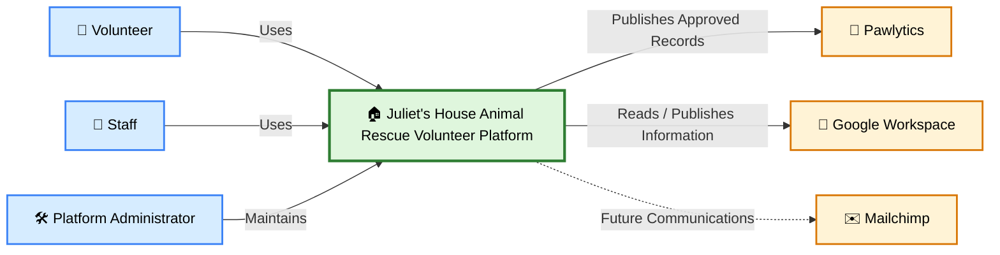

# Juliet's House Animal Rescue Volunteer Platform
*Architecture & Design Repository*


This repository contains the architecture, design decisions, business workflows, diagrams, and supporting documentation for the **Juliet's House Volunteer Platform**.

The repository follows an architecture-first approach, where documentation evolves alongside implementation and serves as the authoritative reference for future platform development.

---

## Purpose

The Juliet's House Volunteer Platform is designed to support the organization's rescue operations by enabling volunteers and staff to capture, manage, and act upon organizational information through intuitive digital experiences.

This repository exists to:

- Define the platform vision
- Document the system architecture
- Capture Architecture Decision Records (ADRs)
- Describe business capabilities and workflows
- Model system interactions using C4 and supporting diagrams
- Guide future implementation
- Preserve architectural consistency as the platform evolves

The platform augments existing organizational processes while integrating with Juliet's House Animal Rescue's existing systems of record.

---

## Platform Context

The following C4 System Context diagram provides the highest-level view of the Juliet's House Volunteer Platform and its relationships with users and external systems.



Implementation details such as workflow engines, AI models, databases, APIs, containers, and hosting infrastructure are intentionally omitted from this view.

---

## Intended Audience

This repository is intended for:

- Juliet's House Leadership
- Enterprise Architects
- Solution Architects
- Software Engineers
- Future Contributors
- Platform Administrators

Documentation is written to be technically accurate while remaining understandable to non-technical stakeholders whenever practical.

---

## Repository Structure

```text
docs/
    Core architecture documentation

docs/adr/
    Architecture Decision Records

docs/capabilities/
    Business capability documentation

diagrams/
    C4, workflow, sequence, deployment, and data model diagrams

backlog/
    Discovery, proposals, and future enhancements

chatgpt/
    AI project configuration and supporting context

assets/
    Images, branding, and supporting media
```

---

## Architectural Principles

The platform is guided by several core architectural principles.

- AI augments people; it does not replace human judgment.
- Human approval is required before organizational data is published.
- Business capabilities are reusable and loosely coupled.
- Business logic is independent of user experiences and integrations.
- External systems remain the authoritative owners of persistent organizational data.
- Documentation evolves alongside implementation.
- Architecture prioritizes maintainability over short-term convenience.
- The platform remains portable and deployment-agnostic.

---

## Documentation Philosophy

Documentation is treated as a first-class engineering artifact.

Architecture documentation is the authoritative source of truth for platform design.

Implementation should follow documented architectural decisions, with documentation evolving as the platform matures.

---

## Where to Start

### 👋 New to the Platform

Read these documents in order:

1. [Vision](docs/vision.md)
2. [Architecture](docs/architecture.md)
3. [Roadmap](docs/roadmap.md)
4. [Glossary](docs/glossary.md)
5. [Assumptions](docs/assumptions.md)

### 🏛 Understanding Architecture Decisions

Review the [Architecture Decision Records (ADRs)](docs/adr/).

### 🧩 Understanding Business Capabilities

Review the [Capability Documentation](docs/capabilities/README.md).

### 📊 Understanding Platform Behavior

Review the [architecture and workflow diagrams](diagrams/).

### ⚙️ Understanding Platform Operations

Review the operational documentation.

---

## Documentation Standards

Repository documentation follows the standards defined in:

- [Documentation Style Guide](docs/documentation-style-guide.md)
- [Diagram Standards](docs/diagram-standards.md)

These documents establish repository-wide conventions for writing, organization, terminology, and diagrams.

---

## Diagram Types

The repository contains multiple architectural viewpoints, including:

- C4 System Context Diagrams
- C4 Container Diagrams
- C4 Component Diagrams
- Business Workflow Diagrams
- Swimlane Diagrams
- Deployment Diagrams
- Sequence Diagrams
- Data Model Diagrams
- Capability Maps

---

## Current Platform Capabilities

Current architectural focus includes:

- Mobile Field Observation
- Observation Review
- Observation Publishing
- Animal Record Updates
- Organizational Knowledge Search

Additional business capabilities and platform services will be introduced as organizational requirements mature.

---

## Contributing

Before contributing architecture documentation, please review:

- Documentation Style Guide
- Diagram Standards
- Existing Architecture Decision Records

Documentation should evolve alongside implementation and remain consistent with established architectural principles.

---

## Repository Status

This repository documents an actively evolving platform.

Architectural decisions, business capabilities, workflows, and integrations will continue to evolve through stakeholder collaboration and iterative platform development.

---

## Repository Goal

The long-term goal of this repository is to provide a comprehensive architectural knowledge base describing:

- Why the platform exists.
- How it is organized.
- What capabilities it provides.
- Why architectural decisions were made.
- How future contributors should extend the platform.

The repository should remain understandable without requiring access to implementation source code.
