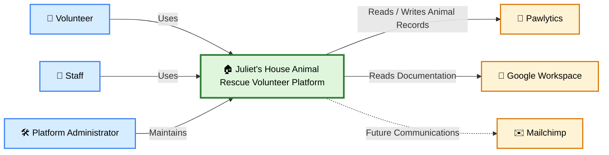

# 01 - System Context

## Purpose

Describe the Juliet's House Animal Rescue Volunteer Platform as a single system and illustrate its relationships with users and external systems.

## Audience

- Leadership
- Volunteers
- Staff
- Developers

## Diagram

## Notes

This diagram represents the highest-level view of the platform.

Implementation details such as n8n, Ollama, Qdrant, Docker, GraphQL, hosting infrastructure, and workflow orchestration are intentionally omitted. Those belong in lower-level architecture diagrams.

The platform is shown as a single system because this diagram focuses on business interactions rather than technical implementation.

## References

- Vision
- Architecture
- ADR-001
## Notes

This diagram represents the highest-level view of the platform.

Implementation details such as n8n, Ollama, Qdrant, Docker, GraphQL, and hosting infrastructure are intentionally omitted. Those details belong in lower-level C4 diagrams.

The Platform is shown as a single system because this diagram focuses on business interactions rather than technical implementation.

## References

- Vision
- Architecture
- ADR-001 Platform First
- ADR-002 Business Workflows
- ADR-003 Integration Layer