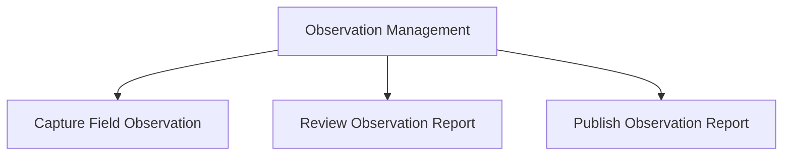

# 02 - Observation Capability Map

## Status

Draft

## Purpose

Show the business capabilities that make up Observation Management.

## Audience

- Business Analysts
- Architects
- Developers
- Future Maintainers

## Diagram

## Notes

This diagram represents business capability decomposition, not process order.

The three capabilities are independently documented.

Workflow, state, and runtime interactions are documented separately.

Observation Reports remain working information until approved information is published to an external system of record.

## References

- [Capture Field Observation](../../docs/capabilities/capture-field-observation.md)
- [Review Observation Report](../../docs/capabilities/review-observation-report.md)
- [Publish Observation Report](../../docs/capabilities/publish-observation-report.md)
- [ADR-004 — Observation-First Business Model](../../docs/adr/004-observation-first-business-model)
