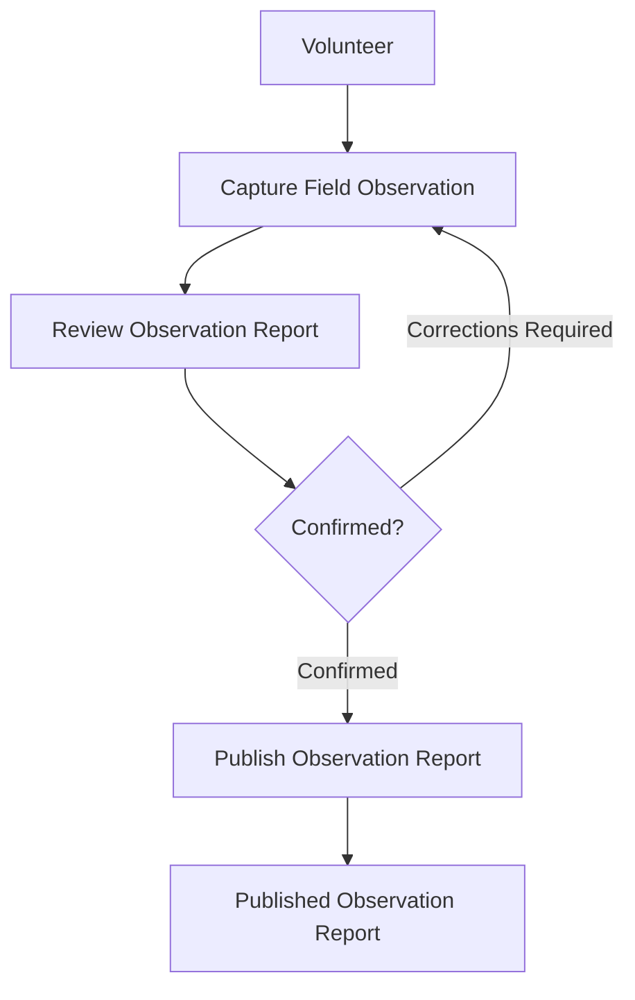

# 03 - Observation Workflow

## Status

Draft

## Purpose

Illustrate the end-to-end business workflow for Observation Management from capture through publication.

## Audience

- Volunteers
- Staff
- Architects
- Developers

## Diagram

## Notes

This diagram represents the business workflow.

The reporter reviews and confirms the proposed Observation Report during the interaction.

Publication makes the confirmed Observation Report available as organizational working information.

The later organizational process that may create an Intake or official animal record is outside this workflow.

Implementation details are documented elsewhere.

## References

- [Capture Field Observation](../../docs/capabilities/capture-field-observation.md)
- [Review Observation Report](../../docs/capabilities/review-observation-report.md)
- [Publish Observation Report](../../docs/capabilities/publish-observation-report.md)
- [ADR-004 — Observation-First Business Model](../../docs/adr/004-observation-first-business-model.md)
