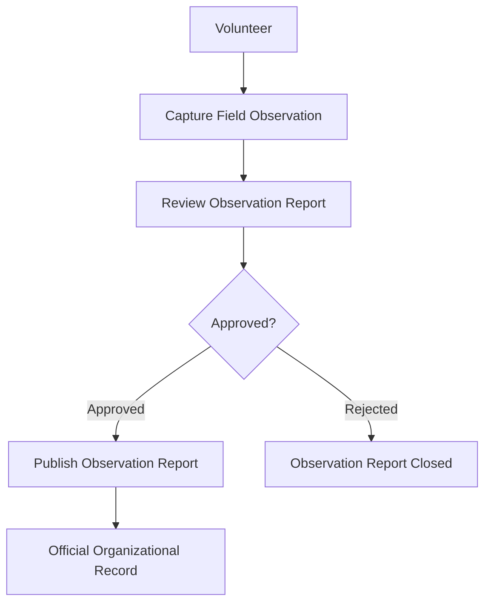

# 03 - Observation Workflow

## Status

Draft

## Purpose

Illustrate the end-to-end business workflow for Observation Management from capture through publication.

## Audience

- Volunteers
- Staff
- Architects
- Developers

## Diagram

## Notes

This diagram represents the business workflow.

Human review determines whether publication occurs.

Publication creates or updates official organizational records.

Implementation details are documented elsewhere.

## References

- [Capture Field Observation](../../docs/capabilities/capture-field-observation.md)
- [Review Observation Report](../../docs/capabilities/review-observation-report.md)
- [Publish Observation Report](../../docs/capabilities/publish-observation-report.md)
- [ADR-004 — Observation-First Business Model](../../docs/adr/004-observation-first-business-model)
