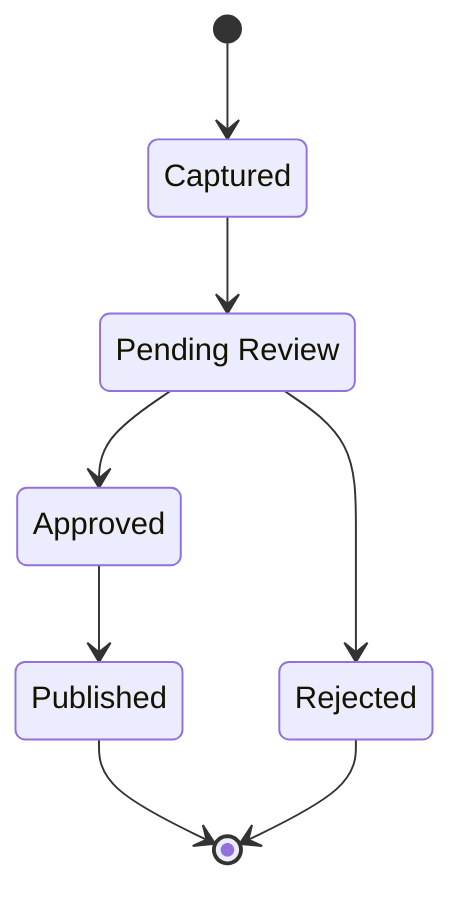

# 04 - Observation State Diagram

## Status

Draft

## Purpose

Illustrate the lifecycle states of an Observation Report from creation through its final disposition.

## Audience

- Staff
- Business Analysts
- Architects
- Developers

## Diagram

## Notes

This diagram represents the business lifecycle of an Observation Report.

State transitions are driven by business decisions.

Implementation details are documented elsewhere.

## References

- [Capture Field Observation](../../docs/capabilities/capture-field-observation.md)
- [Review Observation Report](../../docs/capabilities/review-observation-report.md)
- [Publish Observation Report](../../docs/capabilities/publish-observation-report.md)
- [ADR-004 — Observation-First Business Model](../../docs/adr/004-observation-first-business-model)
