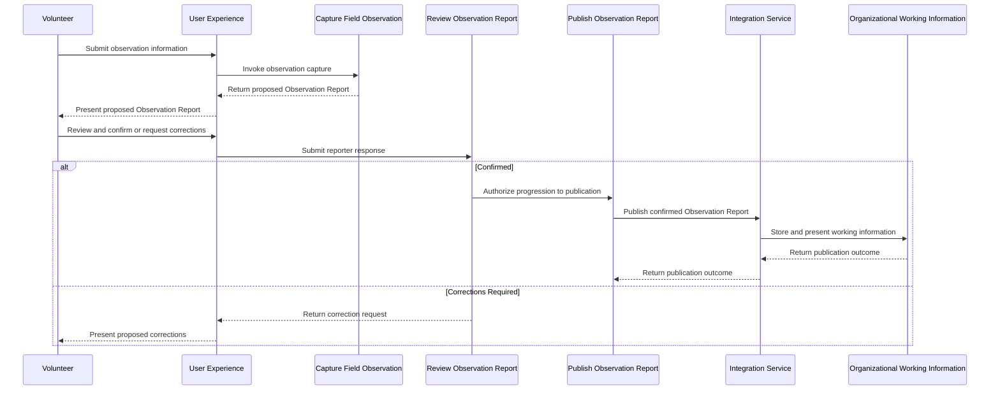

# 05 - Observation Sequence

## Status

Draft

## Purpose

Illustrate the major runtime interactions involved in Observation Management from field capture through human review and publication.

## Audience

- Staff
- Architects
- Developers
- Future Maintainers

## Diagram

## Notes

This diagram represents major runtime interactions across architectural responsibilities.

Business Services remain independent of the User Experience.

Document Service is architecturally accepted but not shown as a runtime interaction because it is not yet implemented.

External-system communication occurs through Integration Services.

Reporter confirmation is required before Observation publication.

Published Observation Reports remain organizational working information. The later organizational Intake review is intentionally omitted.

Implementation-level workflow behavior is intentionally omitted.

## References

- [Architecture](../../docs/architecture.md)
- [Capture Field Observation](../../docs/capabilities/capture-field-observation.md)
- [Review Observation Report](../../docs/capabilities/review-observation-report.md)
- [Publish Observation Report](../../docs/capabilities/publish-observation-report.md)
- [ADR-002 — Reusable Business Services](../../docs/adr/002-reusable-business-services.md)
- [ADR-003 — Dedicated GraphQL Integration Layer](../../docs/adr/003-dedicated-graphQL-integration-layer.md)
- [ADR-004 — Observation-First Business Model](../../docs/adr/004-observation-first-business-model.md)
- [ADR-005 — Reusable Document Service](../../docs/adr/005-reusable-document-service.md)
